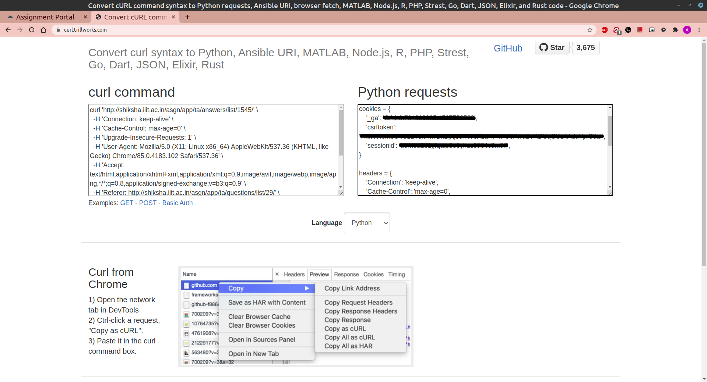

# Shiksha submissions download

- Login with your IIIT credentials and set the role as TA

- Open the list of Homeworks and select


- After opening the HW, do inspect page and click on network


- Refresh the page and copy the first link address as curl as shown


- Open https://curl.trillworks.com/ and paste the above copied link in the **curl command** and get the headers and cookies from **python requests**




- cookies and headers will look something like this for HW 2
```
cookies = {
    '_ga': some string,
    'csrftoken': some string,
    'sessionid': some string,
}

headers = {
    'Connection': 'keep-alive',
    'Cache-Control': 'max-age=0',
    'Upgrade-Insecure-Requests': '1',
    'User-Agent': 'Mozilla/5.0 (X11; Linux x86_64) AppleWebKit/537.36 (KHTML, like Gecko) Chrome/85.0.4183.102 Safari/537.36',
    'Accept': 'text/html,application/xhtml+xml,application/xml;q=0.9,image/avif,image/webp,image/apng,*/*;q=0.8,application/signed-exchange;v=b3;q=0.9',
    'Referer': 'http://shiksha.iiit.ac.in/asgn/app/ta/questions/list/29/',
    'Accept-Language': 'en-US,en;q=0.9,hi;q=0.8,pa;q=0.7',
}
```

- create another header with change in url('Referer' in header)

```
headers1 = {
    'Connection': 'keep-alive',
    'Cache-Control': 'max-age=0',
    'Upgrade-Insecure-Requests': '1',
    'User-Agent': 'Mozilla/5.0 (X11; Linux x86_64) AppleWebKit/537.36 (KHTML, like Gecko) Chrome/85.0.4183.102 Safari/537.36',
    'Accept': 'text/html,application/xhtml+xml,application/xml;q=0.9,image/avif,image/webp,image/apng,*/*;q=0.8,application/signed-exchange;v=b3;q=0.9',
    'Referer': 'http://shiksha.iiit.ac.in/asgn/app/ta/answers/list/1545/',
    'Accept-Language': 'en-US,en;q=0.9,hi;q=0.8,pa;q=0.7',
}
```